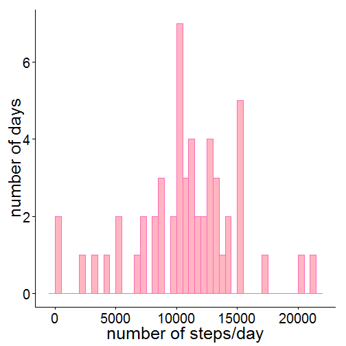
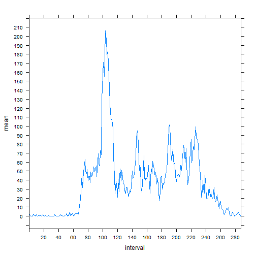
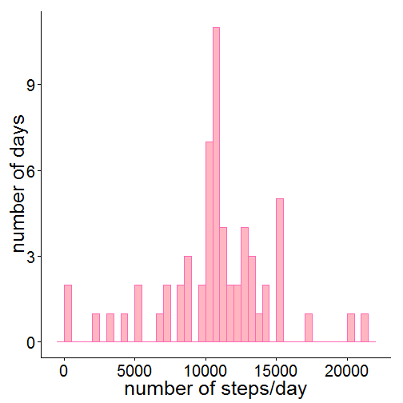
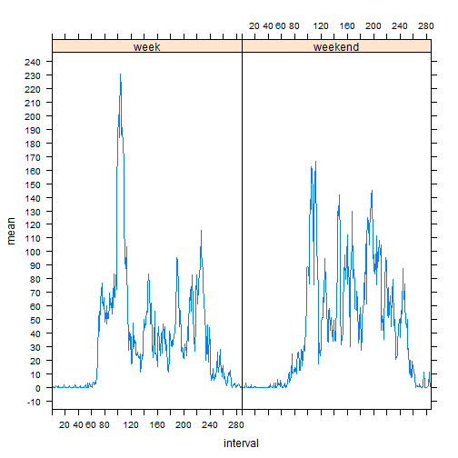

Peer assesment 1 /Vilppu
========================================================

In this project the aim is to analyze some data and give answers to questions in order to learn the workflow of using knitr. I will be utilizing R, R-Studio, Knitr and Github to do so 

First I will download the data and check how it looks


```r
data <- read.csv("activity_data/activity.csv", header = TRUE, sep = ",")

str(data)
```

```
## 'data.frame':	17568 obs. of  3 variables:
##  $ steps   : int  NA NA NA NA NA NA NA NA NA NA ...
##  $ date    : Factor w/ 61 levels "2012-10-01","2012-10-02",..: 1 1 1 1 1 1 1 1 1 1 ...
##  $ interval: int  0 5 10 15 20 25 30 35 40 45 ...
```


In what follows I will first present the questions of the assignement and then answer to them 
and show the code which I have used for the analysis

## What is mean total number of steps taken per day?

1. Make a histogram of the total number of steps taken each day
2. Calculate and report the mean and median total number of steps taken per day


I will use package plyr to count the necessary statistics and ggplot to plot the data. Histogram shows that 10000 steps 
has been the total number steps most often. The median number of steps is 10765, while mean is 10766

```r
library(plyr)
library(ggplot2)

data$steps <- as.numeric(data$steps)

steps.day <- ddply(data, c("date"), summarize, n = sum(steps))

m <- ggplot(steps.day, aes(x = n))
m + geom_histogram(colour = "hotpink", fill = "lightpink", binwidth = 500) + 
    ylab("number of days") + xlab("number of steps/day") + theme_classic(base_size = 25, 
    base_family = "")
```

 

```r

median(steps.day$n, na.rm = TRUE)
```

```
## [1] 10765
```

```r
mean(steps.day$n, na.rm = TRUE)
```

```
## [1] 10766
```


## What is the average daily activity pattern?

1. Make a time series plot (i.e. type = "l") of the 5-minute interval (x-axis) and the average number of steps taken,   averaged across all days (y-axis)
2. Which 5-minute interval, on average across all the days in the dataset, contains the maximum number of steps?

Again I utilize package plyr to count the average number of steps/interval across all days. After this I learned to plot time series data in lattice and produced this very informative graph for you. It shows that around the interval 100, there is a peak in steps taken. Perhaps the study subject is running late every morning and needs to run to the bus stop. I got more precise information of the identity of interval with highest number of steps taken using simple which.max function. Highest number of steps was taken in interval 104. 


```r
library(lattice)
data$interval <- as.factor(data$interval)

steps.interval <- ddply(data, c("interval"), summarize, mean = mean(steps, na.rm = TRUE))
xyplot(mean ~ interval, data = steps.interval, type = "l", xlim = c(0, 288), 
    scales = list(tick.number = 20))
```

 

```r

which.max(steps.interval$mean)
```

```
## [1] 104
```


## Imputing missing values

Note that there are a number of days/intervals where there are missing values (coded as NA). The presence of missing days may introduce bias into some calculations or summaries of the data.

1. Calculate and report the total number of missing values in the dataset (i.e. the total number of rows with NAs)
2.Devise a strategy for filling in all of the missing values in the dataset. The strategy does not need to be sophisticated. For example, you could use the mean/median for that day, or the mean for that 5-minute interval, etc.
3. Create a new dataset that is equal to the original dataset but with the missing data filled in.
4. Make a histogram of the total number of steps taken each day and Calculate and report the mean and median total number of steps taken per day. Do these values differ from the estimates from the first part of the assignment? What is the impact of imputing missing data on the estimates of the total daily number of steps?

Quite a heap of data is missing from the dataset. Missing data;day or interval, can be found in 2304 rows.

```r
sum(is.na(data$steps))
```

```
## [1] 2304
```


For the course work simple and dirty for loop was used replace missing data with the means of every interval. There must be a neat oneliner for this, but could not come up with anything. This however does the trick.

```r
data.old <- data

for (i in 1:nrow(data)) {
    if (is.na(data[i, ]$steps)) {
        data[i, ]$steps <- steps.interval[which(steps.interval$interval == data[i, 
            ]$interval), ]$mean
    }
}
```


Again I create a histogram and count means and medians for number of teps taken/day. Mean and median both conform to 10766. Replacing missing values with means seems to have very small impact on the data of total number of steps taken. 

```r
steps.day.new <- ddply(data, c("date"), summarize, n = sum(steps))
m <- ggplot(steps.day.new, aes(x = n))
m + geom_histogram(colour = "hotpink", fill = "lightpink", binwidth = 500) + 
    ylab("number of days") + xlab("number of steps/day") + theme_classic(base_size = 25, 
    base_family = "")
```

 

```r

median(steps.day.new$n)
```

```
## [1] 10766
```

```r
mean(steps.day.new$n)
```

```
## [1] 10766
```


The final question is about the differences of activity patterns between weeks and weeks

## Are there differences in activity patterns between weekdays and weekends?

1. Create a new factor variable in the dataset with two levels -- "weekday" and "weekend" indicating whether a given date is a weekday or weekend day.
2. Make a panel plot containing a time series plot (i.e. type = "l") of the 5-minute interval (x-axis) and the average number of steps taken, averaged across all weekday days or weekend days (y-axis). 

As was suggested by the instructor, I used "weekdays" to identify weekdays form the dataset. For this I transformed factor "date"" into date object. I created vector to identify weekdays and weekend days, using ifelse function. 


```r
str(data)
```

```
## 'data.frame':	17568 obs. of  3 variables:
##  $ steps   : num  1.717 0.3396 0.1321 0.1509 0.0755 ...
##  $ date    : Factor w/ 61 levels "2012-10-01","2012-10-02",..: 1 1 1 1 1 1 1 1 1 1 ...
##  $ interval: Factor w/ 288 levels "0","5","10","15",..: 1 2 3 4 5 6 7 8 9 10 ...
```

```r
data$ndate <- as.Date(data$date, "%Y-%m-%d")

str(data$ndate)
```

```
##  Date[1:17568], format: "2012-10-01" "2012-10-01" "2012-10-01" "2012-10-01" ...
```

```r
data$weekdays <- weekdays(data$ndate, abbreviate = FALSE)
data$week <- ifelse(data$weekdays %in% c("lauantai", "sunnuntai"), "weekend", 
    "week")

str(data$week)
```

```
##  chr [1:17568] "week" "week" "week" "week" "week" "week" ...
```

```r
data$week <- as.factor(data$week)
```


Finally the time series plots where activity patterns between week and weekend are compared, shows that during the week, study subject has higher activity peaks, wakes up sharply in the morning and slowly drifts to inactivity (sleep?) in the late hours. During the weekend there is larger variation in morning activity, whilst activity usually starts and ends later during the day.  

```r
steps.weekday <- ddply(data, c("date", "week"), summarize, mean = mean(steps))

library(lattice)

wkd.interval <- ddply(data, c("week", "interval"), summarize, mean = mean(steps))
xyplot(mean ~ interval | week, data = wkd.interval, type = "l", xlim = c(0, 
    288), scales = list(tick.number = 20))
```

 

